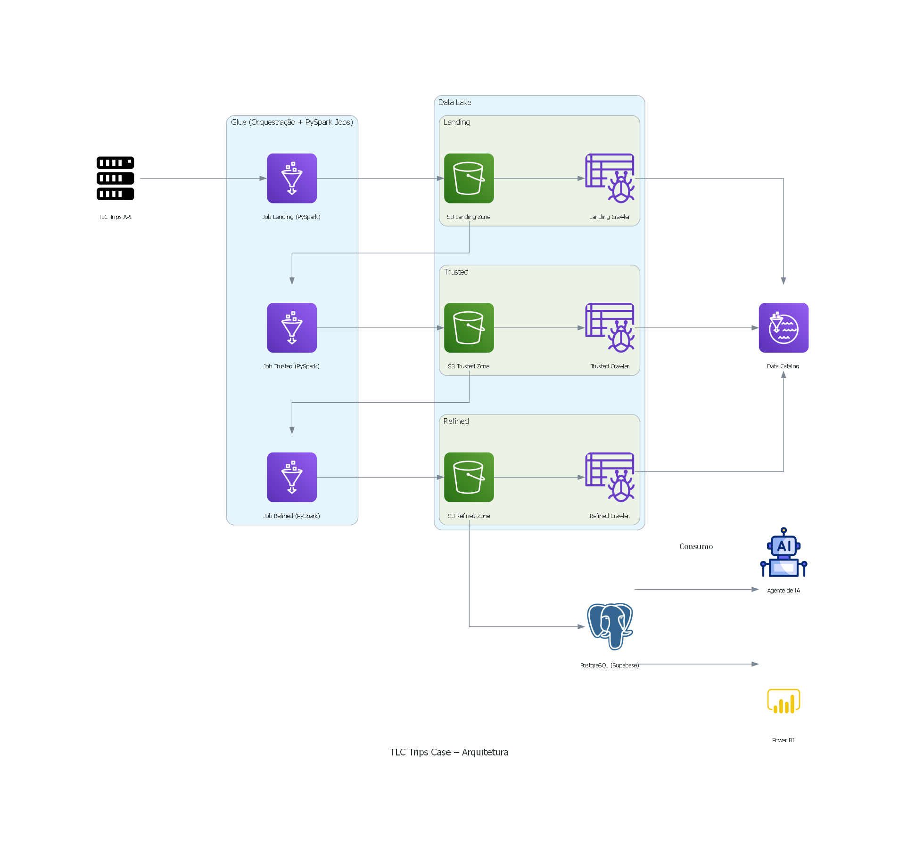

# Case TLC Trips – Data Architecture

O Objetivo central desse projeto é extrair os dados de corridas de taxi de Nova York, tratá-los e depois salvar em um datalake gerenciado. Mas, fui um pouco mais além e desenvolvi uma stack completo de dados, encenando um projeto real onde temos vários entregáveis. 
<br><br>Sendo assim, além do que era necessário, eu também:
- Subi a estrutura completa de engenharia na AWS via **AWS CDK**
- Criei um painel no **PowerBI** para analisar esses dados
- Coloquei em produção um **Agente de IA** que interage com esses dados e retorna informações ao usuário, usando **Flask** no backend e **React + NextJs** no frontend -- Link de teste: [AiFood - Agente de IA](https://aifood-agent.vercel.app/)

Para o objetivo principal e cada um desses tópicos, há um readme em cada pasta com explicação do que foi feito detalhadamente, as tecnologias e como rodar localmente. 

Nesse documento vou trazer uma visão geral do projeto:

<br/>

- [Visão Geral do projeto](#visão-geral-do-projeto)
  - [Pré-requisitos](#pré-requisitos)
  - [Instalação do repositório](#instalação-do-repositório)
  - [Conexões e Variáveis](#conexões-e-variáveis)
  - [Estrutura de Pastas](#estrutura-de-pastas)
- [Sobre o Projeto (Solução do Case)](#sobre-o-projeto-solução-do-case)
  - [Arquitetura de Data Lake](#arquitetura-de-data-lake)
- [Diagrama de Arquitetura](#diagrama-de-arquitetura)
  - [Tecnologias de Metadados e Consumo](#tecnologias-de-metadados-e-consumo)
  - [Respostas às Perguntas do Case](#respostas-às-perguntas-do-case)
- [Monitoramento, Observabilidade e Alertas](#monitoramento-observabilidade-e-alertas)
- [Trade-offs Técnicos](#trade-offs-técnicos)
- [Módulos Extras](#módulos-extras)
  - [Infra AWS com CDK](#infra-aws-com-cdk)
  - [Agente de IA (Flask)](#agente-de-ia-flask)
  - [Frontend (Nextjs)](#frontend-nextjs)
  - [Dashboard Power BI](#dashboard-power-bi)

<br/>

## Visão Geral do projeto

### Pré-requisitos
- #### Etapas de ETL e análises:
  - Python **3.11+**
  - Spark
- #### Backend do agente de IA:
  - Docker (opcional)
- #### Frontend do agente de IA:
  - Node.js **20+**
- #### AWS CDK:
  - Conta **AWS**
- #### Painel do Power BI:
  - Power BI Desktop

### Instalação do repositório
```bash
git clone https://github.com/yagomouro/tlc-trips-case.git
cd tlc-trips-case
python -m venv .venv && source .venv/bin/activate   # Ou no Windows: .venv\Scripts\activate
pip install -r requirements.txt
```

### Conexões e Variáveis
- Por razões de segurnaça não é indicado deixar o arquivo .env na raiz, então copie as chaves do arquivo `.env.example` para um arquivo novo `.env` e preencha todas os valores necessários.

<br>Abaixo explico **para que serve cada uma** e **onde é usada**:

| Variável                | Onde uso            | Pra que serve                                                 | Exemplo (placeholder)       |
| ----------------------- | ------------------- | ------------------------------------------------------------- | --------------------------- |
| `AWS_ACCOUNT`           | **CDK/Infra**       | ID da conta AWS usada no deploy das stacks.                   | `123456789012`              |
| `AWS_ACCESS_KEY`        | **Local/CI**        | Chave de acesso da AWS (se não estiver usando role).          | `AKIA...`                   |
| `AWS_SECRET_ACCESS_KEY` | **Local/CI**        | Segredo da chave de acesso da AWS.                            | `********`                  |
| `AWS_REGION`            | **CDK/Backend/ETL** | Região padrão dos recursos AWS (S3, Glue, etc.).              | `us-east-1`                 |
| `PROJECT_NAME`          | **CDK/Tags**        | Nome do projeto para tagueamento dos recursos.                | `tlc-trips-case`            |
| `PROJECT_OWNER`         | **CDK/Tags**        | Responsável pelo projeto para fins de governança.             | `Seu Nome`                  |
| `BUCKET_NAME`           | **S3 / Data Lake**  | Bucket principal do data lake (landing/silver/gold).          | `datalake-prd-tlc-trips`    |
| `POSTGRES_HOST`         | **Backend (DB QA)** | Host do Postgres usado pelo agente para consultas.            | `db.xxxxxx.supabase.co`     |
| `POSTGRES_PORT`         | **Backend**         | Porta do Postgres.                                            | `5432`                      |
| `POSTGRES_DB`           | **Backend**         | Nome do banco de dados.                                       | `postgres`                  |
| `POSTGRES_USER`         | **Backend**         | Usuário do banco.                                             | `postgres`                  |
| `POSTGRES_PASSWORD`     | **Backend**         | Senha do banco.                                               | `********`                  |
| `POSTGRES_SCHEMA`       | **Backend**         | Schema padrão com as tabelas do case.                         | `tlc_trips`                 |
| `MODEL_CLASSIFIER`      | **Backend (IA)**    | Modelo usado para **classificar o intent** (generic/db/docs). | `gpt-4o-mini`               |
| `MODEL_DB`              | **Backend (IA)**    | Modelo para **responder perguntas de banco (SQL)**.           | `gpt-4o`                    |
| `MODEL_DOCS`            | **Backend (IA)**    | Modelo para **QA de documentos** (conteúdo do S3).            | `gpt-4o`                    |
| `MODEL_GENERIC`         | **Backend (IA)**    | Modelo para **perguntas genéricas**.                          | `gpt-4o`                    |
| `COMPANY_FILES_PREFIX`  | **Backend (IA)**    | Prefixo/pasta no S3 onde ficam os docs da empresa.            | `company-files/`            |
| `MAX_RESULT_ROWS`       | **Backend (DB QA)** | Limite de linhas retornadas em resultados SQL.                | `50`                        |
| `OPENAI_API_KEY`        | **Backend (IA)**    | Chave de API do provedor (OpenAI).                            | `sk-...`                    |
| `OPENAI_BASE_URL`       | **Backend (IA)**    | Endpoint da API (troque se usar gateway/proxy).               | `https://api.openai.com/v1` |


### Estrutura de Pastas
```
.
├── src/                         # Notebooks do pipeline (case principal)
├── analysis/                    # Notebook(s) de análise e evidências
├── extra/
│   ├── aws-cdk/                 # Infraestrutura AWS (CDK)
│   ├── ai-agent-backend/        # Backend Flask do agente de IA
│   ├── ai-agent-frontend/       # Frontend Next.js do agente de IA
│   └── powerbi-dashboard/       # Dashboard Power BI
│   └── images/                  # Imagens utilizadas nos READMEs
├── .env.example
├── .gitignore
├── requirements.txt
└── README.md
```

<br/>

## Sobre o Projeto (Solução do Case)

### Arquitetura de Data Lake
A solução segue camadas **Landing → Trusted → Refined** no **Data Lake** e o processamento é feito com **PySpark**.


## Diagrama de Arquitetura



### Tecnologias de Metadados e Consumo
- Tabelas no **Data Catalog** do AWS, contendo os metadados de todas as bases de dado.
- Consumo por **SQL (PostgresSQL no Supabase)** e **PySpark**.

### Respostas às Perguntas do Case
- **Q1**: Média de valor total por mês em Yellow Taxis.  
- **Q2**: Média de passageiros por hora no mês de Maio/2023.  
Detalhes de execução e queries estão em: [Analysis](analysis/README.md).

<br/>

## Monitoramento, Observabilidade e Alertas
- Utilizei ferramentas da AWS: **CloudWatch** e **Glue Job Metrics**.

## Trade-offs Técnicos
- **Parquet vs Delta**: Escolhido parquet para otimização de resultados e não tendo necessidade de versionamento para o projeto atual. Além de ter maior simplicidade
- **Athena vs PostgreSQL**: Ambos viáveis; escolha depende de custo/governança. No caso eu usei uma base gratuita no Supabase, mas ela não é escalável.


## Módulos Extras

### Infra AWS com CDK
Provisiona buckets S3 (camadas), Glue (DB/Crawlers/Jobs), Workflow agendado, IAM, Secrets.  
Documentação: [AWS CDK](extra/aws-cdk/README.md).

### Agente de IA (Flask)
API unificada com **intent routing** para respostas genéricas, consultas ao **DB** e **QA sobre documentos no S3**.  
Documentação: [AI Agent: Backend](extra/ai-agent-backend/README.md).

### Frontend (Nextjs)
Interface moderna para conversar com o agente, visualizar resultados de **DB** e **documentos**.  
Documentação: [AI Agent: Frontend](extra/ai-agent-frontend/README.md).

### Dashboard Power BI
Relatório `.pbix` conectável às camadas de consumo; KPIs do case incluídos.  
Documentação: [Powerbi](extra/powerbi-dashboard/README.md).

<br/>

