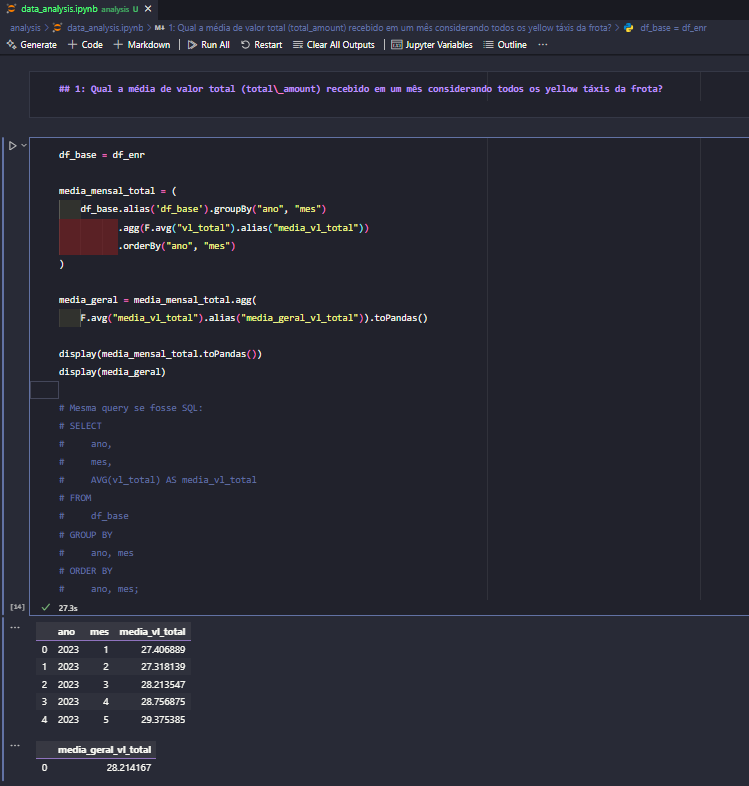
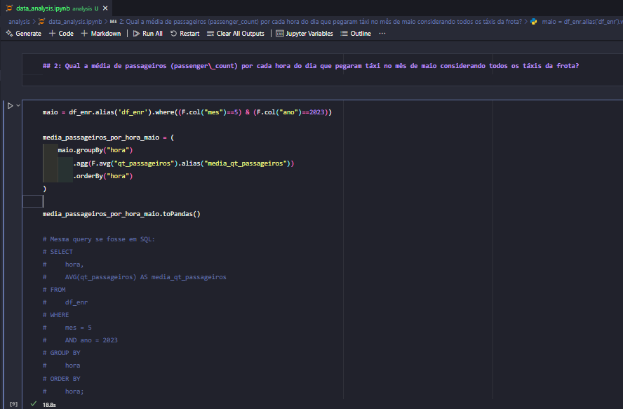
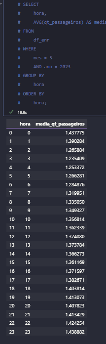

# Análises e Evidências

Este diretório contém a **análise técnica** que responde às duas perguntas do case, usando os dados da **Trusted Zone** que são tratados durante o script.

- [Como rodar](#como-rodar)
   - [Local (Jupyter Notebook)](#local-jupyter-notebook)
- [O que a análise faz (em macro etapas)](#o-que-a-análise-faz-em-macro-etapas)
- [Decisões e justificativas](#decisões-e-justificativas)
- [Resultado das análises solicitadas](#resultado-das-análises-solicitadas)
   - [1: Qual a média de valor total (total\_amount) recebido em um mês considerando todos os yellow táxis da frota? ](#1-qual-a-média-de-valor-total-total_amount-recebido-em-um-mês-considerando-todos-os-yellow-táxis-da-frota-)
   - [2: Qual a média de passageiros (passenger\_count) por cada hora do dia que pegaram táxi no mês de maio considerando todos os táxis da frota? ](#2-qual-a-média-de-passageiros-passenger_count-por-cada-hora-do-dia-que-pegaram-táxi-no-mês-de-maio-considerando-todos-os-táxis-da-frota-)

## Como rodar

### Local (Jupyter Notebook)
Pré-requisitos: Python 3.10+, Spark, conector S3 (`hadoop-aws`) e credenciais AWS no .env.

## O que a análise faz (em macro etapas)

1) **Leitura e checagens iniciais**  
   - Conta total de linhas, conta de duplicados, número de colunas.  
   - `printSchema()` para conferir tipos.  
   - Checagem de **nulos em campos-chave** (início/fim da corrida, valor total, passageiros).  
   **Por quê?** Garantir que o volume e o schema estão corretos e que não temos problemas óbvios de qualidade que prejudiquem as médias.

2) **Exploração estatística simples**  
   - Estatísticas descritivas (mínimo, média, desvio padrão, máximo) para `vl_total`, `qt_passageiros`, `vl_distancia_mi`.  
   **Por quê?** Entender a ordem de grandeza e verificar como estão os dados, para entender as regras de limpeza.

3) **Limpeza com regras objetivas**  
   - Mantém linhas com:
     - `vl_total` maior que **0**
     - `qt_passageiros` maior que **0**
     - `vl_distancia_mi ≥ 0` (descarta distâncias negativas).
   - Checagem de coerência temporal (início < fim) como salvaguarda.  
   - Registra **antes/depois** e **% removido** para transparência.  
   **Por quê?** Remover erros evidentes melhora a qualidade das médias sem distorcer a realidade.

4) **Enriquecimento temporal**  
   - Cria `ano`, `mes`, `hora` a partir de `ts_inicio_corrida`.  
   **Por quê?** Facilita os agrupamentos pedidos (por mês e por hora).

5) **Métricas finais**  
   - **Q1 (mensal):** agrupa por `ano, mes` e calcula média de `vl_total` → ordena por `ano, mes`.  
   - **Q2 (hora em maio/2023):** filtra `ano=2023` e `mes=5`, agrupa por `hora` e calcula média de `qt_passageiros`.  
   **Saída:** dois DataFrames com os resultados prontos para visualização/exportação.

## Decisões e justificativas
- **Coerência temporal**: `ts_inicio_corrida < ts_fim_corrida` evita tempos negativos/invertidos.
- **Enriquecimento `ano/mes/hora`**: padrão de engenharia para tornar agregações temporais previsíveis e reutilizáveis.
- **Sem modelos estatísticos pesados**: a proposta é **entregar respostas confiáveis de forma direta**; outlier modeling pode ser um próximo passo, se necessário.

## Resultado das análises solicitadas
### 1: Qual a média de valor total (total\_amount) recebido em um mês considerando todos os yellow táxis da frota?  
     
### 2: Qual a média de passageiros (passenger\_count) por cada hora do dia que pegaram táxi no mês de maio considerando todos os táxis da frota?  
  
   

