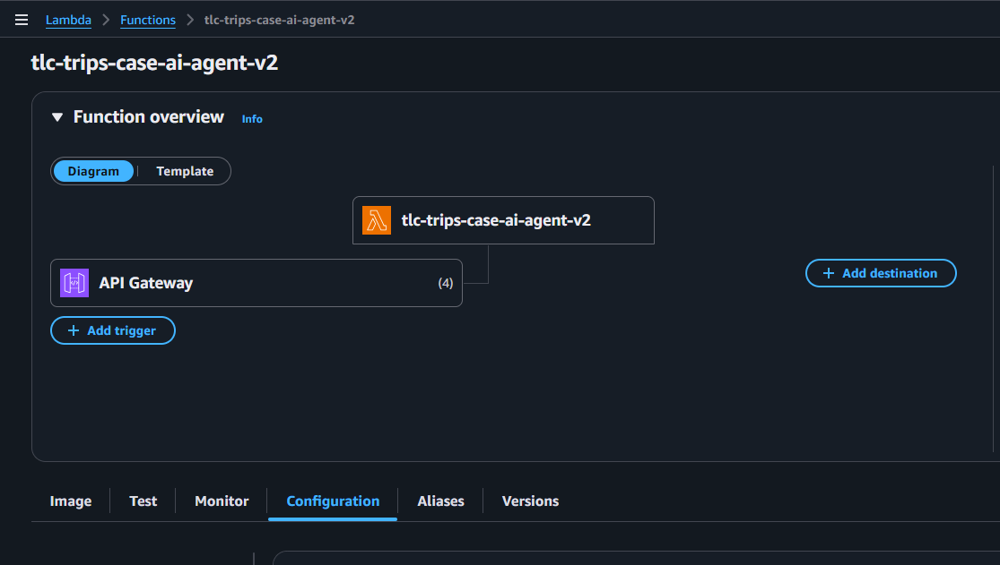

# Backend do Agente de IA

### Visão macro
API em **Flask** que serve o frontend do agente de IA. Eu recebo a pergunta, **classifico o intent** e despacho para o serviço certo:
- **generic** → resposta textual com LLM.
- **db** → gera/executa SELECT no **Postgres (Supabase)** e retorna tabela.
- **docs** → lê **documentos da empresa no S3** e responde com base no contexto.

> Deploy: roda em **AWS Lambda** atrás de **API Gateway**, provisionado via **CDK**.


## Fluxo (alto nível)
```
Frontend → API Gateway → Lambda (Flask/app.py)
                          ├─ services/classifier.py          # decide: generic | db | docs
                          ├─ services/generic_qa.py          # conversa com LLM
                          ├─ services/db_qa.py               # SELECT seguro → Postgres
                          ├─ services/company_docs_s3_qa.py  # contexto de arquivos no S3
                          └─ services/openai_client.py       # cliente LLM

Database: Postgres (Supabase)  
Datalake: S3 (company-files/)  
GenAI: OpenAI
```


## O que tem em cada arquivo (explicação por cima)
- **app.py**  
  Sobe o Flask, expõe `POST /chat` e `GET /health`, faz o fio-terra entre o **classifier** e os serviços (`generic_qa`, `db_qa`, `company_docs_s3_qa`) e lida com CORS.

- **services/classifier.py**  
  Usa LLM com um schema simples para devolver `{ intent: "generic" | "db" | "docs" }`. Em erro, cai em `generic`.

- **services/generic_qa.py**  
  Resposta **geral** com LLM (tom objetivo e seguro). Não acessa banco nem S3.

- **services/db_qa.py**  
  Gera **apenas SELECT** em Postgres (schema `tlc_trips`), faz validação básica e executa no Supabase. Retorna `{ columns, rows }` com limite de linhas.

- **services/company_docs_s3_qa.py**  
  Lista arquivos no **S3** (PDF/DOCX/TXT/MD), extrai texto, monta **contexto curto** e responde **somente** com base no que estiver nos documentos.

- **services/openai_client.py**  
  Cliente do provedor de modelos (chave/endpoint + chat). Centraliza a chamada ao LLM.

- **Dockerfile / requirements.txt / .dockerignore**  
  Empacotamento e dependências para rodar localmente, em container ou empurrar para a Lambda.


## Endpoints (macro)
- `POST /ask`  
  **Body**: `{ "message": "..." }` (+ metadados opcionais)  
  **Retornos comuns**:
  - Genérico → `{ "type": "generic", "answer": "..." }`
  - Dados → `{ "type": "data", "columns": ["..."], "rows": [[...]], "rowCount": 123 }`
  - Documentos → `{ "type": "docs", "files": ["s3://..."], "answer": "..." }`

- `GET /health` → `{"ok": true}`


## Como rodar local (dev rápido)
```bash
# 1) Ativar venv e instalar deps  
   cd extra/ai-agent-backend  
   python -m venv .venv && source .venv/bin/activate        # Windows: .venv\Scripts\activate  
   pip install -r requirements.txt

# 2) Preparar `.env` com as variáveis acima e subir  
   python app.py   # http://localhost:5000

# Teste rápido:
curl -X POST http://localhost:5000/chat \
  -H "Content-Type: application/json" \
  -d '{
          "question": "Oi, quais são os dados da historia da empresa?",
          "metadata": {
              "user": "teste"
          }
      }'
```

### Docker (opcional)
docker build -t ai-agent-backend .
docker run --env-file .env -p 5000:5000 ai-agent-backend


## Deploy na AWS (macro)
- **CDK** cria **Lambda + API Gateway** (com CORS), roles de acesso ao **S3** (prefixo dos docs) e ao **Secrets Manager**.
- Ajustes comuns: **timeout** (30–60s), **memória** (512–1024MB), **CORS** para o domínio do frontend, e monitoramento no **CloudWatch**.


## Prints

### Pergunta do banco de dados:


### Pergunta dos dados do S3:


### Pergunta genérica:


### Pergunta genérica:


### Lambda Function:

