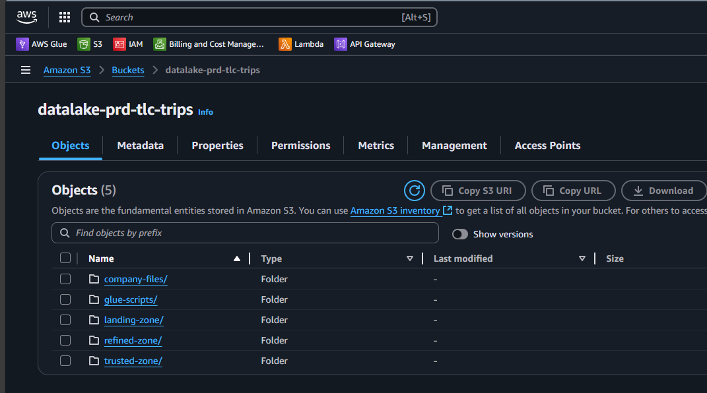
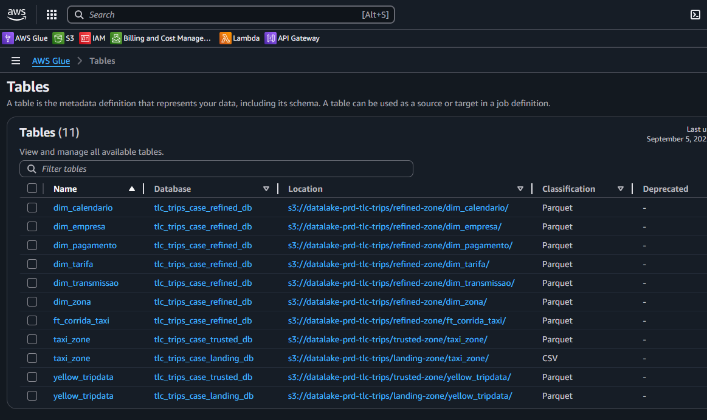
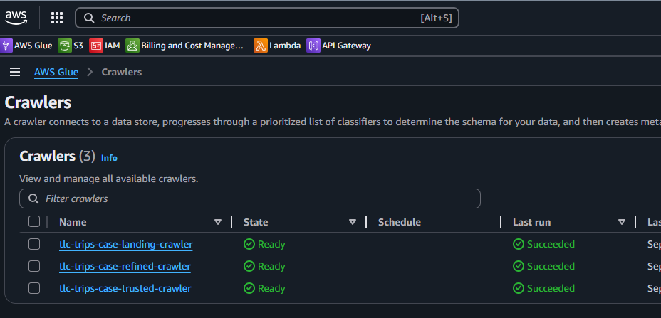
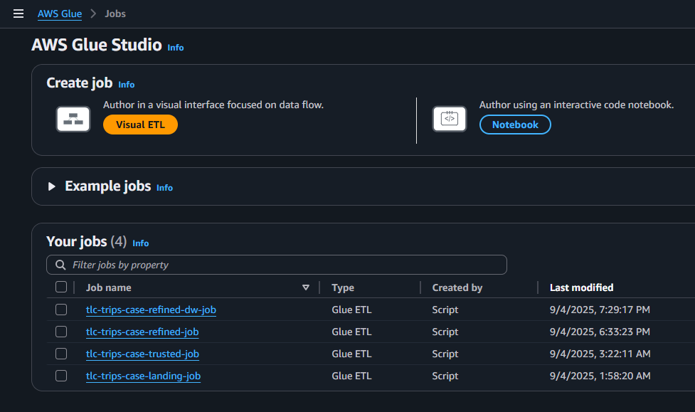
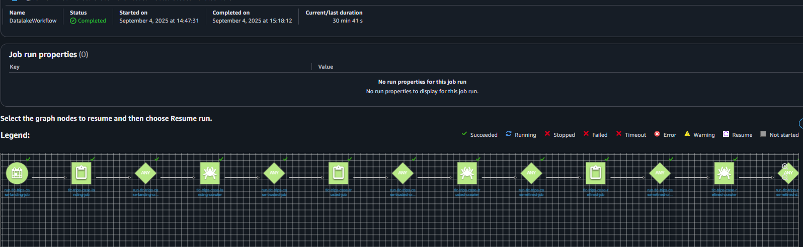
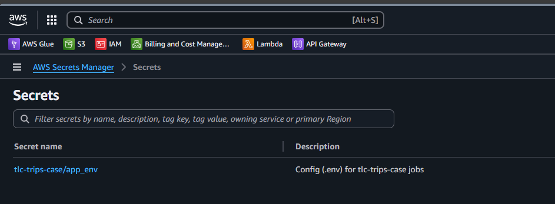
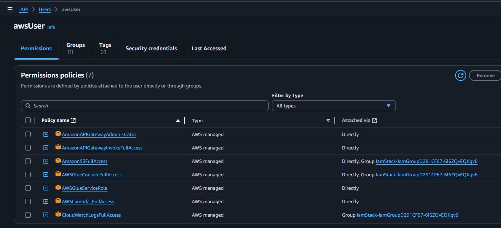
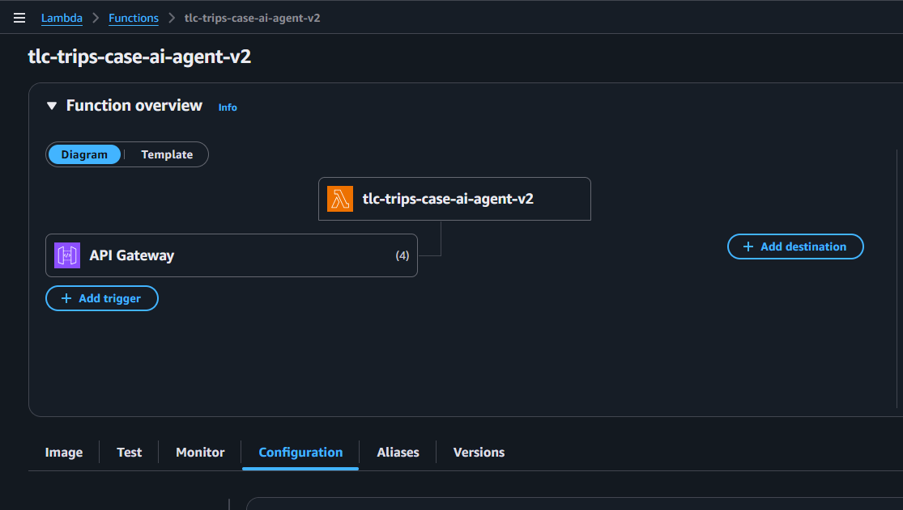

# AWS CDK: Infra as a code 

- [O que é](#o-que-é)
- [Como rodar](#como-rodar)
- [Prints](#prints)
- [S3 — buckets e pastas:](#s3--buckets-e-pastas)
- [Glue — Data Catalog (DB):](#glue--data-catalog-db)
- [Glue — Crawlers por camada:](#glue--crawlers-por-camada)
- [Glue — Jobs (Landing, Trusted, Refined, Refined\_to\_dw):](#glue--jobs-landing-trusted-refined-refined_to_dw)
- [Glue — Workflow:](#glue--workflow)
- [Secrets Manager — variáveis sensíveis:](#secrets-manager--variáveis-sensíveis)
- [IAM — roles/policies dos jobs:](#iam--rolespolicies-dos-jobs)
- [Lambda Function:](#lambda-function)


## O que é
O AWS CDK é um kit de desenvolvimento para subir estruturas na cloud da Amazon usando linguagem de programação.
Nesse código eu subi tudo o que precisei para orquestrar as pipelines da solução:
- S3 com as camadas do data lake (Landing, Trusted, Refined, DW).
- AWS Glue com Data Catalog (DB), Crawlers e Jobs PySpark para cada etapa (Landing → Trusted → Refined → DW).
- Secrets para variáveis sensíveis (ex.: credenciais do Postgres).
- Workflow/Agendamento se eu quiser encadear as etapas.
- Lambda Function para o backend do agente de ia que está aqui: [AI Agent - Backend](../ai-agent-backend/README.md)

A ideia é simples: ter o ambiente pronto em poucos comandos, versionado e reproduzível.


## Como rodar
Pré-requisitos básicos: AWS CLI autenticada, Node.js

Comandos principais:

``` bash
npm i -g aws-cdk

# primeira vez na conta/região
cdk bootstrap

# visualizar/template
cdk synth

# criar tudo
cdk deploy --all
```


## Prints
Abaixo ficam os prints dos recursos que foram criados:

### S3 — buckets e pastas:


### Glue — Data Catalog (DB):


### Glue — Crawlers por camada:


### Glue — Jobs (Landing, Trusted, Refined, Refined_to_dw):


### Glue — Workflow:


### Secrets Manager — variáveis sensíveis:


### IAM — roles/policies dos jobs:


### Lambda Function:
