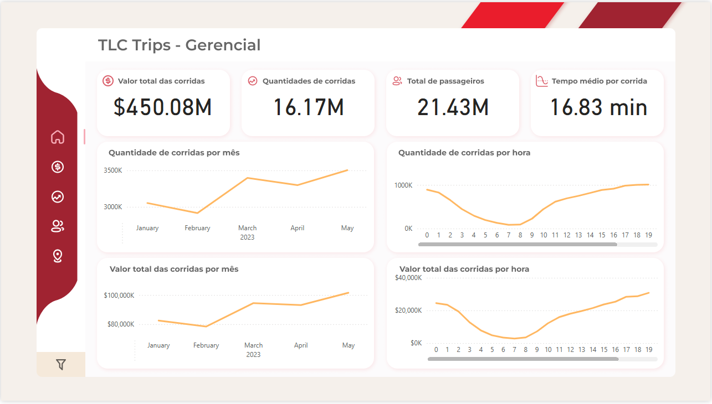
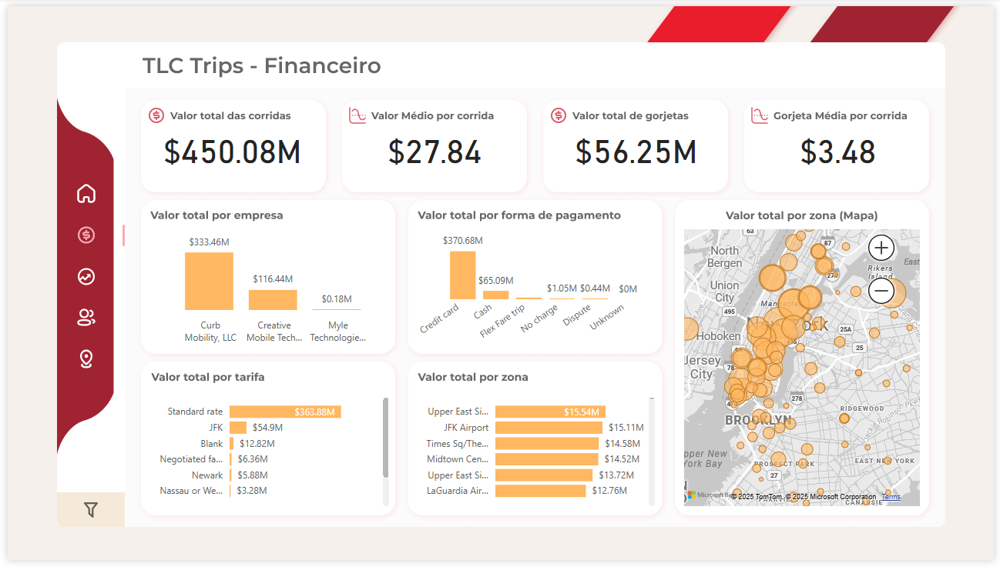
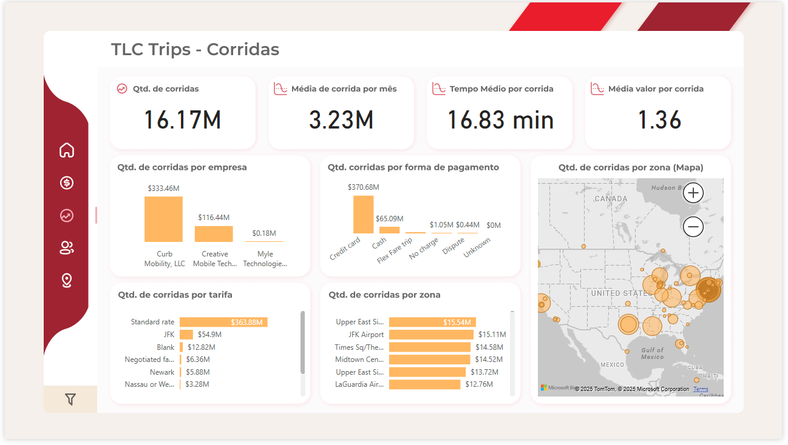
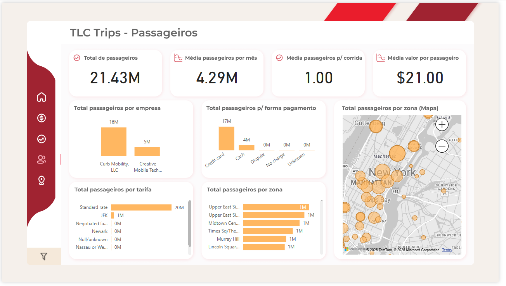
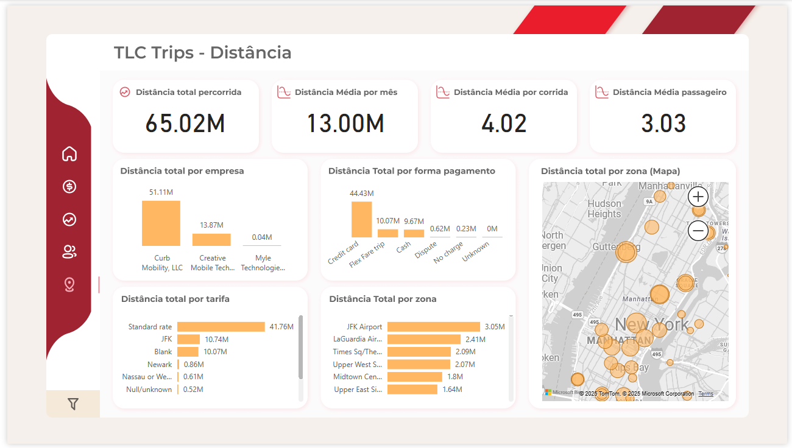
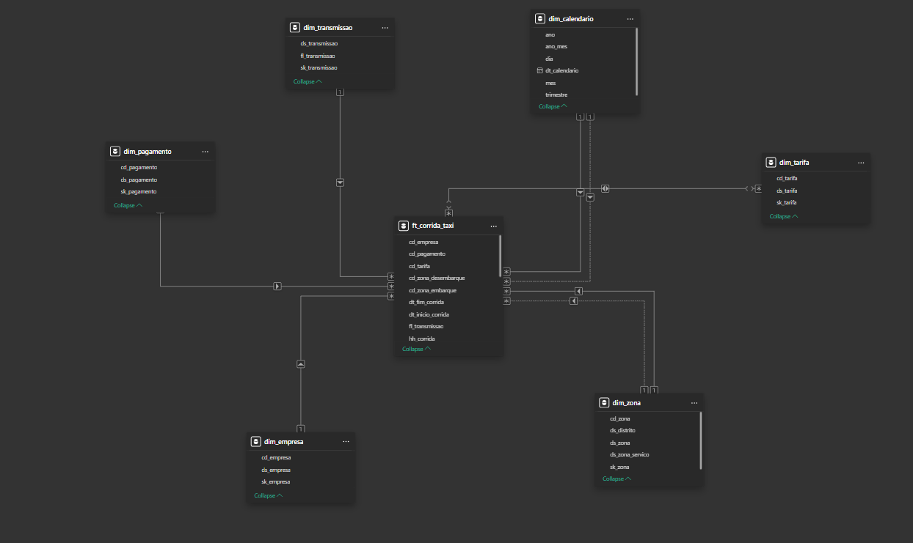

# Power BI – TLC Trips 
Desenvolvi esse relatório com a ideia de dar uma visão rápida para gestão e, ao mesmo tempo, permitir análises operacionais/financeiras sem esforço. Para acessá-lo, basta abrir o arquivo `Tlc Trips.pbix` no **Power BI Desktop**

- [Objetivo e impacto](#objetivo-e-impacto)
- [Estrutura do relatório (páginas)](#estrutura-do-relatório-páginas)
  - [Gerencial](#gerencial)
  - [Financeiro](#financeiro)
  - [Corridas](#corridas)
  - [Passageiros](#passageiros)
  - [Distância](#distância)
- [Modelagem de dados](#modelagem-de-dados) 
  

## Objetivo e impacto
Criei esse dashboard para transformar os dados extraídos das etapas de engenharia em informações valiosas para que a gestão possa utilizar e tomar iniciativas a partir delas. Com ele dá para:

- **Planejar frota e operação:** ver claramente as horas e as zonas com maior demanda e ajustar a alocação de motoristas.
- **Acompanhar o financeiro:** acompanhar receita, valor médio por corrida e gorjetas por empresa, tarifa e forma de pagamento.
- **Entender o comportamento dos passageiros:** olhar ocupação (passageiros por corrida) e a distribuição por zonas.
- **Ganhar eficiência e reduzir custos:** medir tempo médio e distâncias para otimizar rotas e políticas de preço.

Principais indicadores (KPIs): valor total, quantidade de corridas, total de passageiros, tempo/distância médios, valor médio por corrida e gorjeta média.

  

## Estrutura do relatório (páginas)

### Gerencial
    
**KPIs:** Valor total das corridas, Quantidade de corridas, Total de passageiros, Tempo médio por corrida.  
**Visuais:** Séries por **mês** e por **hora** para volume (corridas) e valor.  
 
**Perguntas que responde:**  
- Como evoluiu o volume e a receita ao longo dos meses?  
- Em quais **horas do dia** a demanda e a receita são maiores?

### Financeiro
   
**KPIs:** Valor total das corridas, **Valor médio por corrida**, **Valor total de gorjetas**, **Gorjeta média**.  
**Visuais:** Quebra por **empresa**, **forma de pagamento**, **tarifa** e **mapa por zona**.  
 
**Perguntas que responde:**  
- Quais empresas concentram maior **receita**?  
- Qual a participação de **cartão/dinheiro**?  
- Quais **zonas** e **tarifas** geram mais valor?  
- Como se comportam as **gorjetas** por recorte?

### Corridas
   
**KPIs:** Quantidade de corridas, **Média de corridas por mês**, **Tempo médio por corrida**, **Média valor por corrida**.  
**Visuais:** Corridas por **empresa**, **forma de pagamento**, **tarifa**, **zona** e **mapa**.  
 
**Perguntas que responde:**  
- Quem puxa o volume de corridas?  
- Como o volume se distribui por **tarifa** e **zona**?  
- Onde estão os **hotspots** no mapa?

### Passageiros
   
**KPIs:** **Total de passageiros**, **Média passageiros por mês**, **Média por corrida**, **Média valor por passageiro**.  
**Visuais:** Passageiros por **empresa**, **forma de pagamento**, **tarifa**, **zona** e **mapa**.  
 
**Perguntas que responde:**  
- Qual o perfil de **ocupação** por recorte?  
- Como varia o **valor por passageiro** entre zonas e tarifas?

### Distância
   
**KPIs:** **Distância total**, **Distância média por mês**, **Distância média por corrida**, **Distância média por passageiro**.  
**Visuais:** Distância por **empresa**, **forma de pagamento**, **tarifa**, **zona** e **mapa**.  
 
**Perguntas que responde:**  
- Quais recortes apresentam corridas mais **longas**?  
- Quais **zonas** concentram maiores deslocamentos?

## Modelagem de dados
Aqui utilizei a modelagem analítica **Star Schema** com uma tabela fato e várias dimensões que realizam o filtro dela.

   

